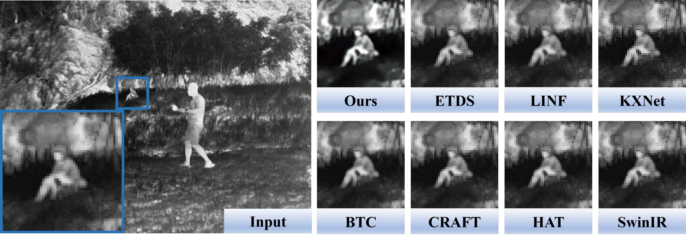

<h2 align="center">DEAL: Data-Efficient Adversarial Learning for High-Quality Infrared Imaging</h2>

Zhu Liu†, Zijun Wang†, Jinyuan Liu‡, Fanqi Meng†, Long Ma†, Risheng Liu†*
†School of Software Technology, Dalian University of Technology
‡School of Mechanical Engineering, Dalian University of Technology
liuzhu@mail.dlut.edu.cn,wzijun6@gmail.com, rsliu@dlut.edu.cn
</div>


:star: If DEAL is helpful for you, please help star this repo. Thanks! :fire::fire::fire: 


## :book: Table Of Contents

- [TODO](#todo)
- [Abstract](#abstract)
- [Framework Overview](#framework_overview)
- [Visual Display](#visual_comparison)
- [Setup](#setup)
- [Training](#training)
- [Test](#inference)

<!-- - [Installation](#installation)

- [Inference](#inference) -->

## <a name="todo"></a>:hourglass: TODO

- [x] Release Code ​1​.​0:computer:
- [ ] Release benchmark ​

## <a name="abstract"></a>:fireworks: Abstract

> Thermal imaging is often compromised by dynamic, complex degradations caused by hardware limitations and unpredictable environmental factors. 
The scarcity of high-quality infrared data, coupled with the challenges of dynamic, intricate degradations, makes it difficult to recover details using existing methods. 
In this paper, we introduce thermal degradation simulation integrated into the training process via a mini-max optimization, by modeling these degraded factors as adversarial attacks on thermal images. 
The simulation is dynamic to maximize objective functions, thus capturing a broad spectrum of degraded data distributions.
 This approach enables training with limited data, thereby improving model performance. Additionally, we introduce a dual-interaction network that combines the benefits
  of spiking neural networks with scale transformation to capture degraded features with sharp spike signal inten- sities. This architecture ensures compact model parameters 
  while preserving eficient feature representation. Extensive experiments demonstrate that our method not only achieves superior visual quality under diverse single and composited degradation, 
  but also delivers a significant reduction in processing when trained on only fifty clear images, outperforming existing techniques in eficiency and accuracy. 

## <a name="framework_overview"></a>:eyes: Framework Overview


:star: Overview of DEAL. We present a data-efficient adversarial learning strategy, which constructs the dynamic degradation generation to guide the image enhancement procedure with a Dynamic Adversarial Solution (DAS) at (a). The concrete architecture of dual interaction network, consisting of Scale Transform Module (STM) and Spiking-guided Separation Module (SSM) is shown at (b). Spiking-guided Separation to capture sharp intensities of thermal degradations is depicted at (c).

## <a name="visual_comparison"></a>:chart_with_upwards_trend: Visual Display

 

 

#### Visual display on stripe noise


#### Visual display on super-resolution



#### Visual display on composited degradation


## <a name="setup"></a> ⚙️ Setup
```bash
conda env create -f environment.yaml
```
#### We will compile as many infrared enhancement-related comparison methods and our experimental results as possible into the following link as soon as possible.

## <a name="training"></a> :wrench: Training

#### Step1: Prepare training data
We train the DEAL on M3FD [[Baidu Netdisk]](https://pan.baidu.com/s/19Q_KuApT30tRP5p14Dyrug?pwd=u49w ) . The final 50 photos used for training are [here](https://pan.baidu.com/s/1da8xgTW3CmVP-RCuAKViJQ?pwd=rd19).

#### Step2: Training for DEAL

cd /DEAL/DEAL1.0/scripts

```bash
python train.py
```

## <a name="inference"></a> 💫 Test

#### Step1: Download the pretrained models

If you want to perform some tests on our model, download the pretrained model [[Baidu Netdisk]](https://pan.baidu.com/s/1XW1zbj0FKdUTefi7fjiXKg?pwd=kiuy) 

#### Step3: Inference for DEAL

run:

```bash
cd 
python Load_Ours.py
```

## :smiley: Citation

Please cite us if our work is useful for your research.

```
@inproceedings{liu2025deal,
  title={DEAL: Data-Efficient Adversarial Learning for High-Quality Infrared Imaging},
  author={Liu, Zhu and Wang, Zijun and Liu, Jinyuan and Meng, Fanqi and Ma, Long and Liu, Risheng},
  booktitle={Proceedings of the IEEE/CVF Conference on Computer Vision and Pattern Recognition},
  year={2025}
}
```


## :envelope: Contact

If you have any questions, please feel free to contact liuzhu@mail.dlut.edu.cn, wzijun6@gmail.com, mengfq0525@gmail.com.

